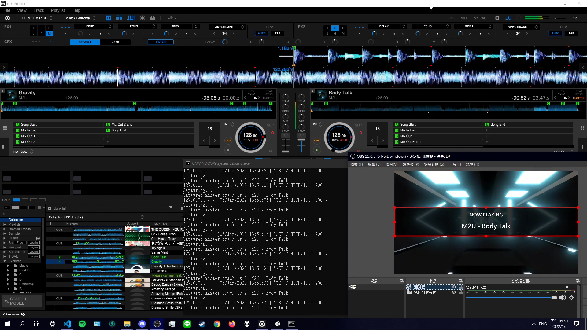

# Rekordbox NowPlaying
Get now playing track in rekordbox.  
**ONLY WORKS WHEN REKORDBOX IS 1920*1080 FULLSCREEN ON MONITOR 1**  
  

# Requirements
- Python 3 (Only tested with Python 3.8.2)
- [Tesseract](https://github.com/UB-Mannheim/tesseract/wiki)
- [Tesseract Trained Data](https://github.com/tesseract-ocr/tessdata_best) if you need more languages

# Install
- Clone or download repo.
- Run `pip install -r requirements.txt` to install dependencies.
- Edit `config.py`
- Run `python main.py`
- Web server will be started on [http://127.0.0.1:5000](http://127.0.0.1:5000)
